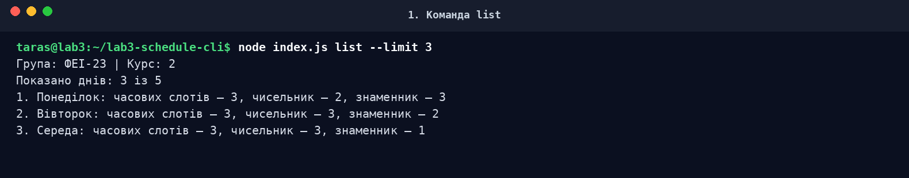
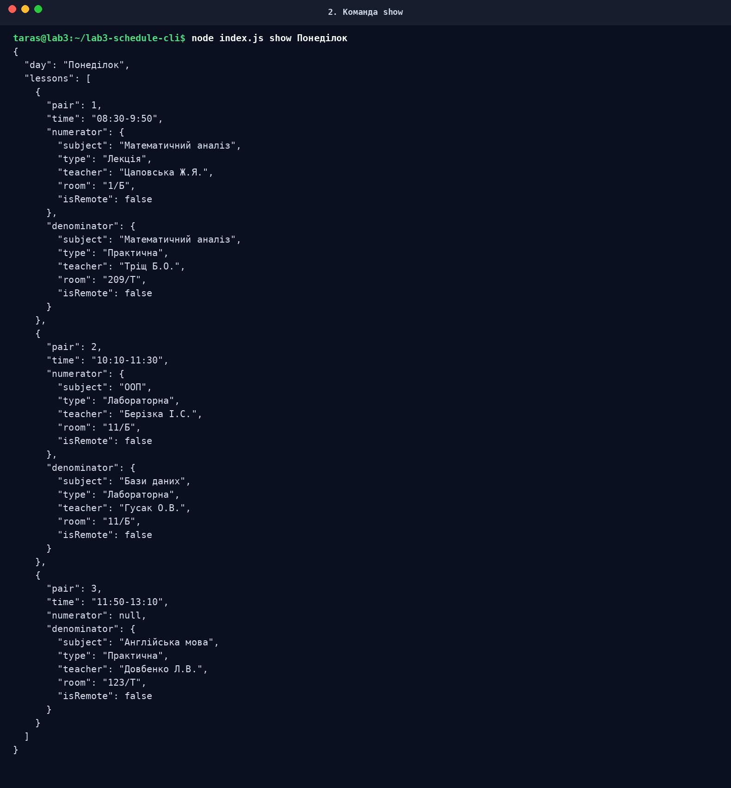
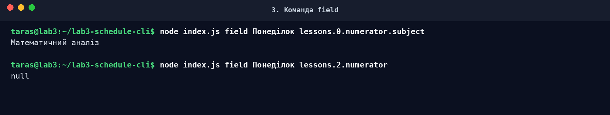
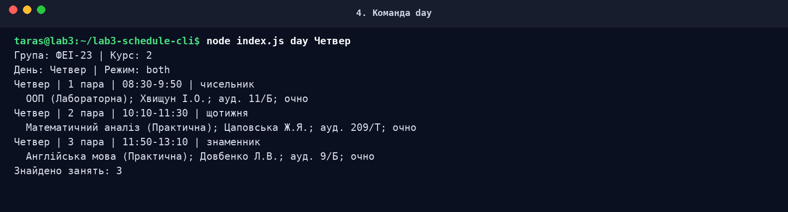
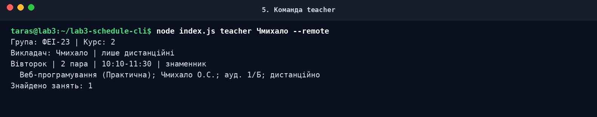
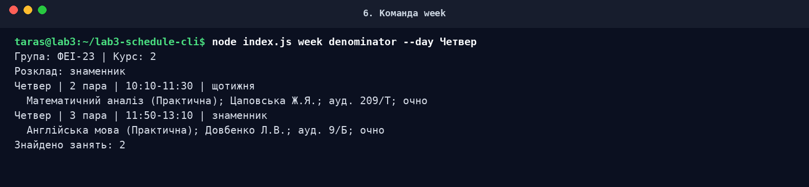
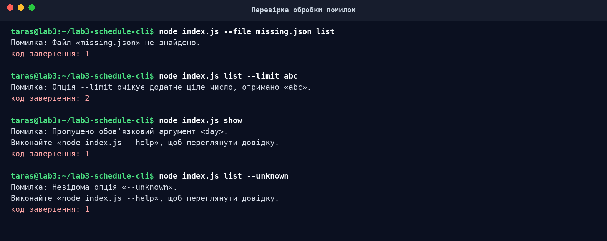
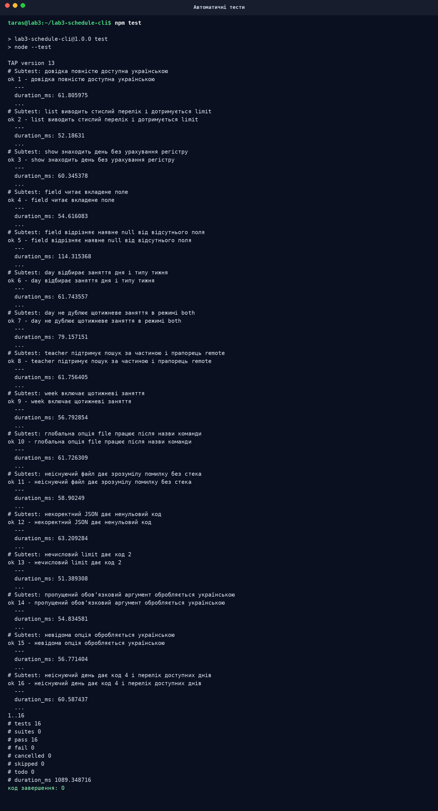

# МІНІСТЕРСТВО ОСВІТИ І НАУКИ УКРАЇНИ

# ЛЬВІВСЬКИЙ НАЦІОНАЛЬНИЙ УНІВЕРСИТЕТ ІМЕНІ ІВАНА ФРАНКА

## Факультет електроніки та комп’ютерних технологій

## Кафедра системного проектування

<br><br>

# ЗВІТ

## до лабораторної роботи № 3

## «Робота з Node.js, npm. Практика програмування на JavaScript»

### Варіант 1 — «Розклад занять»

<br><br>

**Виконав:** студент групи ФЕІ-23  
**Тарас Лесів**

**Перевірив:** асистент  
**Олександр Сергійович Чмихало**

<br><br>

## Львів — 2026

---

# 1. Тема, мета та завдання роботи

**Тема:** створення CLI-програми на Node.js із використанням npm, пакета Commander та власного JSON-документа.

**Варіант:** 1. Предметна область — **розклад занять**.

**Мета роботи:** навчитися створювати npm-проєкт і розуміти призначення `package.json`, `package-lock.json` та `node_modules`; установлювати залежності; опрацьовувати аргументи командного рядка за допомогою Commander; описувати команди, обов’язкові аргументи, опції зі значенням і прапорці; читати й розбирати JSON із вкладеними масивами та об’єктами; обробляти помилки без стека викликів і повертати коректний код завершення.

Для досягнення мети потрібно реалізувати:

1. три загальні можливості: стислий перелік елементів, один елемент повністю, окреме вкладене поле;
2. три можливості варіанта 1: заняття за день; заняття викладача з фільтром дистанційного формату; розклад чисельника/знаменника зі щотижневими заняттями;
3. глобальну опцію шляху до JSON-файлу;
4. україномовну довідку й контрольовану обробку помилок;
5. щонайменше п’ять логічних Git-комітів.

# 2. Програмне середовище

Контрольний запуск готової роботи виконано в такому середовищі:

| Компонент | Версія / значення |
|---|---|
| Операційна система | Linux 6.1.158+, x86_64 |
| Оболонка | Bash |
| Node.js | v20.20.2 |
| npm | 10.8.2 |
| Commander | 14.0.3 |
| Git | 2.47.3 |
| jq | 1.7 |

Команди перевірки:

```bash
node --version
npm --version
npm list commander --depth=0
git --version
jq --version
```

Commander 14.0.3 вимагає Node.js версії не нижче 20, тому в `package.json` додано `"engines": { "node": ">=20" }`.

# 3. Репозиторій і історія Git

Профіль GitHub: <https://github.com/TarasLesiv>  
Репозиторій роботи: <https://github.com/TarasLesiv/lab3-schedule-cli>

Перед першим комітом локальне ім’я автора налаштовано окремо для цього репозиторію:

```bash
git config --local user.name "Тарас Лесів lab3"
git config --local user.email "ВАШ_GITHUB_EMAIL"
git config --local user.name
```

Результат останньої команди:

```text
Тарас Лесів lab3
```

Email у команді залишено для заповнення власним GitHub email. У підготовленій локальній історії використано технічний заповнювач, який треба замінити перед остаточною публікацією або відтворити коміти за інструкцією `docs/STEP_BY_STEP.md`.

Вивід `git log --oneline` (п’ять логічно окремих комітів до додавання фінального звіту):

```text
9e09520 docs: add usage guide, theory and command outputs
4e0fb5c test: add CLI integration tests
ada7bee feat: implement schedule CLI commands
328e630 data: add validated schedule JSON
e872a64 chore: initialize npm project and add commander
```

Після додавання цього звіту створюється шостий коміт:

```bash
git add docs/REPORT.md report-lab3.docx
git commit -m "docs: add complete laboratory report"
```

# 4. Створення npm-проєкту

Початкові команди:

```bash
npm init -y
npm install commander
```

`npm init -y` створив початковий `package.json` зі стандартними значеннями. `npm install commander` додав єдину сторонню залежність, створив `package-lock.json` і каталог `node_modules`. Далі вручну додано ESM-режим та сценарії:

- `"type": "module"` — дозволяє синтаксис `import`;
- `"start": "node index.js"` — стандартний запуск програми;
- `"test": "node --test"` — запуск інтеграційних тестів;
- `"check:data": "jq empty data.json"` — синтаксична перевірка JSON.

Повний `package.json`:

```json
{
  "name": "lab3-schedule-cli",
  "version": "1.0.0",
  "description": "CLI-програма для роботи з розкладом занять (лабораторна робота №3, варіант 1)",
  "type": "module",
  "main": "index.js",
  "bin": {
    "schedule-cli": "./index.js"
  },
  "scripts": {
    "start": "node index.js",
    "test": "node --test",
    "check:data": "jq empty data.json"
  },
  "keywords": [
    "nodejs",
    "commander",
    "cli",
    "schedule"
  ],
  "author": "Тарас Лесів",
  "license": "MIT",
  "engines": {
    "node": ">=20"
  },
  "dependencies": {
    "commander": "^14.0.3"
  }
}
```

## 4.1. Призначення службових файлів

- `package.json` — маніфест із метаданими, сценаріями та діапазоном версії Commander;
- `package-lock.json` — точне дерево залежностей із версією 14.0.3 і контрольною сумою;
- `node_modules/` — локально встановлені файли залежностей; каталог не додається в Git;
- `.gitignore` — містить правило `node_modules/`, а також службові журнали й `.DS_Store`.

## 4.2. Структура проєкту

```text
lab3-schedule-cli/
├── .gitignore
├── README.md
├── data.json
├── index.js
├── package.json
├── package-lock.json
├── report-lab3.docx
├── docs/
│   ├── REPORT.md
│   ├── STEP_BY_STEP.md
│   ├── THEORY.md
│   └── screenshots/
│       ├── 01-list.png
│       ├── 02-show.png
│       ├── 03-field.png
│       ├── 04-day.png
│       ├── 05-teacher.png
│       ├── 06-week.png
│       ├── 07-errors.png
│       └── 08-tests.png
└── test/
    └── cli.test.js
```

# 5. Вхідні дані `data.json`

Вхідний файл `schedule.txt` із попередньої роботи містив правильний JSON. Його перейменовано на `data.json` відповідно до методички; значення полів не змінювалися. Перевірка:

```bash
jq empty data.json
echo $?
```

Результат:

```text
0
```

Корінь документа містить групу, курс і масив `schedule`. Кожен елемент `schedule` — день із полями `day` і `lessons`. Кожен часовий слот містить номер пари, час та два вкладені поля: `numerator` і `denominator`. Значення кожного з них — об’єкт заняття або `null`. Об’єкт заняття має предмет, тип, викладача, аудиторію та ознаку дистанційності.

Ця структура безпосередньо вплинула на рішення програми:

- основним елементом для загальних команд обрано **день**, бо саме день є елементом верхнього масиву `schedule`;
- вкладені поля читаються крапковим шляхом на зразок `lessons.0.numerator.subject`;
- чисельник і знаменник є ключами часового слота;
- щотижнева пара розпізнається, коли об’єкти `numerator` і `denominator` рівні за вмістом;
- прапорець дистанційності безпосередньо перевіряє `isRemote === true`.

Крім синтаксичної перевірки `jq`, програма валідує структуру: тип `group`, додатний цілий `course`, масиви днів і пар, рядкові поля заняття та логічне поле `isRemote`.

# 6. Проєктування інтерфейсу командного рядка

## 6.1. Глобальні засоби

Загальна форма запуску:

```text
node index.js [global options] <command> [arguments] [command options]
```

Глобальна опція:

```text
-f, --file <path>
```

Вона доступна кожній команді. Стандартне значення — `data.json`. Відносний шлях визначається від поточного робочого каталогу через `resolve(process.cwd(), filePath)`. Альтернативою було жорстко записати ім’я файлу або дублювати опцію в кожній команді; це відхилено, бо методичка прямо вимагає спільну опцію.

Додатково є стандартні засоби:

- `-V, --version` — версія `1.0.0`;
- `-h, --help` — україномовна довідка;
- `help [command]` — довідка окремої команди.

Вивід `node index.js --help`:

```text
Використання: schedule-cli [options] [command]

CLI-програма для роботи з розкладом занять групи (варіант 1).

Опції:
  -V, --version      Показати версію програми
  -f, --file <path>  Шлях до JSON-файлу з розкладом (default: "data.json")
  -h, --help         Показати довідку

Команди:
  list [options]            Показати стислий перелік днів розкладу
  show <day>                Показати повний JSON одного дня
  field <day> <path>        Показати поле дня за крапковим шляхом
  day [options] <day>       Показати заняття за обраний день тижня
  teacher [options] <name>  Знайти заняття певного викладача
  week [options] <type>     Показати розклад для чисельника або знаменника
  help [command]            Показати довідку для команди
```

## 6.2. Обґрунтування команд, аргументів та опцій

| Команда | Форма | Призначення |
|---|---|---|
| `list` | `list [--limit <number>]` | Стислий перелік днів |
| `show` | `show <day>` | Повний об’єкт одного дня |
| `field` | `field <day> <path>` | Значення окремого вкладеного поля |
| `day` | `day <day> [--week <type>]` | Заняття обраного дня |
| `teacher` | `teacher <name> [--remote]` | Заняття викладача |
| `week` | `week <type> [--day <day>]` | Розклад чисельника/знаменника |

### Команда `list`

**Рішення.** Основними елементами є дні. Команда показує назву дня, кількість часових слотів та кількість непорожніх занять чисельника і знаменника. Опція `--limit <number>` є необов’язковою опцією зі значенням.

**Перевірка.** Значення має бути додатним безпечним цілим числом. `abc`, `0`, від’ємне чи дробове значення дає код `2`.

**Альтернатива.** Можна було зробити основним елементом окрему пару, попередньо сплющивши всі дні. Це гірше відповідає вихідному верхньому масиву й ускладнює ідентифікацію елемента, тому обрано день.

### Команда `show`

**Рішення.** Обов’язковий аргумент `<day>` є назвою дня. Пошук нечутливий до регістру та виду апострофа. Знайдений об’єкт друкується через `JSON.stringify(..., null, 2)`.

**Помилки.** Пропуск аргументу виявляє Commander; відсутній день дає перелік доступних днів і код `4`.

**Альтернатива.** Індекс дня був би коротшим, але менш зрозумілим для користувача та нестійким до зміни порядку масиву.

### Команда `field`

**Рішення.** Має два обов’язкові аргументи: день і універсальний крапковий шлях. Числовий фрагмент шляху є індексом масиву. `Object.hasOwn()` перевіряє саме наявність властивості.

**Різниця між `null` і відсутнім полем.** Якщо властивість існує та дорівнює `null`, команда успішно друкує `null` і повертає `0`. Якщо на будь-якому кроці властивості немає, повертається код `4`.

**Альтернатива.** Можна було дозволити лише фіксований набір полів або використати JSONPath. Фіксований набір не виконував би вимогу універсального вкладеного поля, а JSONPath потребував би ще одного стороннього пакета. Тому реалізовано просту крапкову нотацію власним кодом.

### Команда `day`

**Рішення.** Обов’язковий аргумент `<day>` визначає день. Опція `--week <type>` приймає `numerator`, `denominator` або `both`; стандартне значення — `both`. Це дозволяє однією командою переглянути весь день або конкретний тип тижня.

Якщо в одному слоті обидва об’єкти рівні, у режимі `both` пара друкується один раз із позначкою `щотижня`.

**Альтернатива.** Окремі команди `day-numerator` і `day-denominator` дублювали б логіку. Одна опція краще масштабується.

### Команда `teacher`

**Рішення.** Обов’язковий аргумент `<name>` може бути повним іменем або його частиною, наприклад `Чмихало`. Пошук нечутливий до регістру. Прапорець `--remote` не має значення: сама його наявність вмикає фільтр `isRemote === true`.

Щотижневі заняття попередньо зводяться до одного входження, щоб викладач не з’являвся двічі в тому самому слоті.

**Помилки.** Якщо результатів немає, команда пояснює, який пошук не дав збігів, і повертає код `4`.

**Альтернатива.** Точний збіг із повним рядком викладача був би простішим, але користувач мусив би знати ініціали та пунктуацію. Пошук за підрядком зручніший.

### Команда `week`

**Рішення.** Обов’язковий аргумент `<type>` приймає тільки `numerator` або `denominator`. Опція зі значенням `--day <day>` за потреби обмежує результат одним днем. Щотижнева пара входить до обох типів і має окрему позначку.

**Помилки.** Значення `both` тут навмисно не дозволено: команда реалізує саме вибір одного типу тижня. Невідоме значення дає код `2`.

**Альтернатива.** Можна було додати поле `weekly` до JSON, але це змінило б документ із ЛР №1. Наявна структура вже кодує щотижневу пару однаковими об’єктами, тому використано порівняння їхнього вмісту.

# 7. Структура та пояснення коду

## 7.1. Основні програмні блоки

| Рядки `index.js` | Призначення |
|---:|---|
| 1 | Shebang дозволяє запускати файл як виконуваний CLI у Unix-системах |
| 3–5 | Імпорт Commander і вбудованих модулів `node:fs`, `node:path` |
| 7–8 | Стандартний файл і допустимі типи тижня |
| 11–17 | Клас `CliError` з повідомленням і кодом завершення |
| 20–71 | Генерація повністю україномовної довідки |
| 73–94 | Переклад типових помилок синтаксису виклику Commander |
| 97–150 | Перевірка всієї очікуваної структури JSON |
| 153–177 | Читання UTF-8, обробка файлових помилок і `JSON.parse` |
| 180–193 | Нормалізація та пошук дня |
| 196–210 | Перевірка числової опції й типу тижня |
| 213–252 | Виявлення щотижневих пар і форматування занять |
| 255–278 | Читання вкладеного поля й форматування довільного значення |
| 280–295 | Назва, опис, версія, глобальна опція, довідка й `exitOverride` |
| 297–319 | Команда `list` |
| 321–329 | Команда `show` |
| 331–341 | Команда `field` |
| 343–371 | Команда `day` |
| 373–398 | Команда `teacher` |
| 400–425 | Команда `week` |
| 427–453 | Єдина точка обробки помилок і запуск програми |

## 7.2. Читання файлу

Обрано синхронний `readFileSync`, тому що CLI читає один невеликий файл один раз перед формуванням результату. Для серверної програми доцільніше було б асинхронне API, але тут синхронне читання робить порядок дій прозорим і не блокує тривалий процес. `resolve(process.cwd(), filePath)` однаково працює з відносним та абсолютним шляхом.

## 7.3. Обробка помилок

Очікувані проблеми перетворюються на `CliError`. Commander працює з `exitOverride()`, тому замість негайного завершення його `CommanderError` потрапляє до `catch`. Типові англійські повідомлення замінено українськими. Стек не друкується.

Коди завершення:

| Код | Значення |
|---:|---|
| 0 | Успіх |
| 1 | Файл, JSON або структура даних некоректні |
| 2 | Некоректне значення параметра |
| 4 | Запитаний день, поле чи збіг не знайдено |

# 8. Результати виконання шести можливостей

## 8.1. Стислий перелік — `list`

Команда:

```bash
node index.js list --limit 3
```

Результат:

```text
Група: ФЕІ-23 | Курс: 2
Показано днів: 3 із 5
1. Понеділок: часових слотів — 3, чисельник — 2, знаменник — 3
2. Вівторок: часових слотів — 3, чисельник — 3, знаменник — 2
3. Середа: часових слотів — 3, чисельник — 3, знаменник — 1
```

Опція обмежила масив результату першими трьома днями. Для кожного дня обчислено статистику за вкладеним масивом `lessons`.



## 8.2. Один елемент повністю — `show`

Команда:

```bash
node index.js show Понеділок
```

Результат:

```json
{
  "day": "Понеділок",
  "lessons": [
    {
      "pair": 1,
      "time": "08:30-9:50",
      "numerator": {
        "subject": "Математичний аналіз",
        "type": "Лекція",
        "teacher": "Цаповська Ж.Я.",
        "room": "1/Б",
        "isRemote": false
      },
      "denominator": {
        "subject": "Математичний аналіз",
        "type": "Практична",
        "teacher": "Тріщ Б.О.",
        "room": "209/Т",
        "isRemote": false
      }
    },
    {
      "pair": 2,
      "time": "10:10-11:30",
      "numerator": {
        "subject": "ООП",
        "type": "Лабораторна",
        "teacher": "Берізка І.С.",
        "room": "11/Б",
        "isRemote": false
      },
      "denominator": {
        "subject": "Бази даних",
        "type": "Лабораторна",
        "teacher": "Гусак О.В.",
        "room": "11/Б",
        "isRemote": false
      }
    },
    {
      "pair": 3,
      "time": "11:50-13:10",
      "numerator": null,
      "denominator": {
        "subject": "Англійська мова",
        "type": "Практична",
        "teacher": "Довбенко Л.В.",
        "room": "123/Т",
        "isRemote": false
      }
    }
  ]
}
```

Знайдено день за полем `day`; надруковано весь об’єкт, включно з масивом пар і вкладеними об’єктами чисельника/знаменника.



## 8.3. Окреме вкладене поле — `field`

Команди:

```bash
node index.js field Понеділок lessons.0.numerator.subject
node index.js field Понеділок lessons.2.numerator
```

Результат:

```text
Математичний аналіз
null
```

Перший шлях проходить через масив `lessons`, індекс `0`, об’єкт `numerator` і поле `subject`. Другий шлях існує, а його результат дорівнює `null`.



## 8.4. Заняття за день — `day`

Команда:

```bash
node index.js day Четвер
```

Результат:

```text
Група: ФЕІ-23 | Курс: 2
День: Четвер | Режим: both
Четвер | 1 пара | 08:30-9:50 | чисельник
  ООП (Лабораторна); Хвищун І.О.; ауд. 11/Б; очно
Четвер | 2 пара | 10:10-11:30 | щотижня
  Математичний аналіз (Практична); Цаповська Ж.Я.; ауд. 209/Т; очно
Четвер | 3 пара | 11:50-13:10 | знаменник
  Англійська мова (Практична); Довбенко Л.В.; ауд. 9/Б; очно
Знайдено занять: 3
```

Друга пара має однакові об’єкти в `numerator` та `denominator`, тому надрукована один раз як щотижнева.



## 8.5. Дистанційні заняття викладача — `teacher`

Команда:

```bash
node index.js teacher Чмихало --remote
```

Результат:

```text
Група: ФЕІ-23 | Курс: 2
Викладач: Чмихало | лише дистанційні
Вівторок | 2 пара | 10:10-11:30 | знаменник
  Веб-програмування (Практична); Чмихало О.С.; ауд. 1/Б; дистанційно
Знайдено занять: 1
```

Пошук за підрядком знайшов викладача `Чмихало О.С.`, а прапорець залишив лише заняття зі значенням `isRemote: true`.



## 8.6. Розклад знаменника — `week`

Команда:

```bash
node index.js week denominator --day Четвер
```

Результат:

```text
Група: ФЕІ-23 | Курс: 2
Розклад: знаменник
Четвер | 2 пара | 10:10-11:30 | щотижня
  Математичний аналіз (Практична); Цаповська Ж.Я.; ауд. 209/Т; очно
Четвер | 3 пара | 11:50-13:10 | знаменник
  Англійська мова (Практична); Довбенко Л.В.; ауд. 9/Б; очно
Знайдено занять: 2
```

До знаменника включено щотижневу другу пару та специфічну для знаменника третю пару.



# 9. Перевірка помилкових викликів

| Ситуація | Приклад | Реакція | Код |
|---|---|---|---:|
| Неіснуючий файл | `--file missing.json list` | Повідомлення, що файл не знайдено | 1 |
| Некоректний JSON | `--file invalid.json list` | Повідомлення з причиною `JSON.parse` | 1 |
| Неіснуючий день | `show Неділя` | Перелік доступних днів | 4 |
| Неіснуюче поле | `field Понеділок lessons.99.subject` | Повідомлення, що шлях не існує | 4 |
| Нечислове значення | `list --limit abc` | Вимога додатного цілого | 2 |
| Пропущений аргумент | `show` | Україномовне повідомлення Commander | ненульовий |
| Невідома опція | `list --unknown` | Україномовне повідомлення Commander | ненульовий |

Приклад повної перевірки в терміналі:



Для створення некоректного JSON використано:

```bash
printf '{ bad json' > invalid.json
node index.js --file invalid.json list
echo $?
rm invalid.json
```

Жоден із цих випадків не друкує стек викликів.

# 10. Автоматичне тестування та відновлення залежностей

Створено 16 інтеграційних тестів на вбудованому `node:test`, без додаткових пакетів. Запуск:

```bash
npm test
```

Перевірено довідку, усі шість можливостей, обидві позиції глобальної опції `--file`, різницю між `null` і відсутнім полем, неіснуючий файл, некоректний JSON, нечислове значення, пропущений аргумент та невідому опцію. Результат: **16 тестів пройдено, 0 помилок**.



Відновлення залежностей перевіряється командами:

```bash
rm -rf node_modules
npm install
npm test
```

Після повторного встановлення тести проходять так само. Отже, `node_modules` можна безпечно не зберігати в Git, а проєкт відтворюється з `package.json` та `package-lock.json`.

# 11. Висновки

Під час лабораторної роботи я створив npm-проєкт із єдиною сторонньою залежністю Commander та реалізував CLI для власної вкладеної структури розкладу. Найскладнішими рішеннями були універсальний доступ до вкладеного поля, чітке розрізнення відсутньої властивості й `null`, а також недопущення дублювання щотижневої пари.

Структура JSON суттєво визначила інтерфейс програми. Оскільки верхній масив складається з днів, саме день став основним елементом команд `list`, `show` і `field`. Поля `numerator` та `denominator` природно стали значеннями аргументів типу тижня. Ознака `isRemote` дозволила реалізувати прапорець без перетворення даних.

Обробка помилок виявилася не менш важливою за позитивний сценарій: файлові помилки, синтаксис JSON, структура даних і неправильний виклик Commander мають різне походження, але для користувача вони подані однаково зрозуміло українською та без технічного стека.

Якби проєкт потрібно було розширювати, я виніс би читання даних, форматування та команди в окремі модулі, додав би нормалізацію часу `08:30-09:50` на рівні даних і формальну JSON Schema. Для обсягу цієї лабораторної один `index.js` спрощує перевірку та дає змогу додати повний текст програми до звіту.

# 12. Додатки

## Додаток А. Повний текст `index.js`

```javascript
#!/usr/bin/env node

import { Command, CommanderError } from 'commander';
import { readFileSync } from 'node:fs';
import { resolve } from 'node:path';

const DEFAULT_FILE = 'data.json';
const WEEK_TYPES = ['numerator', 'denominator'];

/** Помилка предметної логіки без виведення стека викликів. */
class CliError extends Error {
  constructor(message, exitCode = 1) {
    super(message);
    this.name = 'CliError';
    this.exitCode = exitCode;
  }
}

/** Формує повністю україномовну довідку Commander. */
function formatHelp(command, helper) {
  const rows = (items, term, description) => {
    if (items.length === 0) return '';
    const terms = items.map(term);
    const width = Math.max(...terms.map((item) => item.length));
    return items
      .map((item, index) => `  ${terms[index].padEnd(width)}  ${description(item)}`)
      .join('\n');
  };

  const sections = [];
  sections.push(`Використання: ${helper.commandUsage(command)}`);

  const description = helper.commandDescription(command);
  if (description) sections.push(description);

  const args = helper.visibleArguments(command);
  if (args.length > 0) {
    sections.push(
      `Аргументи:\n${rows(
        args,
        (arg) => helper.argumentTerm(arg),
        (arg) => helper.argumentDescription(arg),
      )}`,
    );
  }

  const options = helper.visibleOptions(command);
  if (options.length > 0) {
    sections.push(
      `Опції:\n${rows(
        options,
        (option) => helper.optionTerm(option),
        (option) => helper.optionDescription(option),
      )}`,
    );
  }

  const commands = helper.visibleCommands(command);
  if (commands.length > 0) {
    sections.push(
      `Команди:\n${rows(
        commands,
        (subcommand) => helper.subcommandTerm(subcommand),
        (subcommand) => helper.subcommandDescription(subcommand),
      )}`,
    );
  }

  return `${sections.join('\n\n')}\n`;
}

/** Перетворює типові повідомлення Commander українською. */
function translateCommanderError(error) {
  const message = error.message ?? '';
  let match;

  if ((match = message.match(/missing required argument '([^']+)'/))) {
    return `Пропущено обов'язковий аргумент <${match[1]}>.`;
  }
  if ((match = message.match(/unknown option '([^']+)'/))) {
    return `Невідома опція «${match[1]}».`;
  }
  if ((match = message.match(/unknown command '([^']+)'/))) {
    return `Невідома команда «${match[1]}».`;
  }
  if ((match = message.match(/option '([^']+)' argument missing/))) {
    return `Для опції «${match[1]}» не вказано значення.`;
  }
  if (message.includes('too many arguments')) {
    return 'Передано забагато аргументів.';
  }

  return message.replace(/^error:\s*/i, '') || 'Некоректний виклик програми.';
}

/** Перевіряє, що значення є звичайним об'єктом. */
function isObject(value) {
  return value !== null && typeof value === 'object' && !Array.isArray(value);
}

/** Перевіряє структуру JSON, потрібну всім командам. */
function validateData(data) {
  if (!isObject(data)) {
    throw new CliError('Корінь JSON-документа має бути об’єктом.');
  }
  if (typeof data.group !== 'string' || data.group.trim() === '') {
    throw new CliError('Поле «group» має бути непорожнім рядком.');
  }
  if (!Number.isInteger(data.course) || data.course < 1) {
    throw new CliError('Поле «course» має бути додатним цілим числом.');
  }
  if (!Array.isArray(data.schedule)) {
    throw new CliError('Поле «schedule» має бути масивом.');
  }

  data.schedule.forEach((day, dayIndex) => {
    if (!isObject(day) || typeof day.day !== 'string' || !Array.isArray(day.lessons)) {
      throw new CliError(`Некоректна структура дня schedule[${dayIndex}].`);
    }

    day.lessons.forEach((slot, lessonIndex) => {
      const location = `schedule[${dayIndex}].lessons[${lessonIndex}]`;
      if (!isObject(slot)) {
        throw new CliError(`${location} має бути об’єктом.`);
      }
      if (!Number.isInteger(slot.pair) || typeof slot.time !== 'string') {
        throw new CliError(`${location} повинен містити ціле «pair» і рядок «time».`);
      }

      for (const weekType of WEEK_TYPES) {
        const lesson = slot[weekType];
        if (lesson === null) continue;
        if (!isObject(lesson)) {
          throw new CliError(`${location}.${weekType} має бути об’єктом або null.`);
        }

        for (const field of ['subject', 'type', 'teacher', 'room']) {
          if (typeof lesson[field] !== 'string') {
            throw new CliError(`${location}.${weekType}.${field} має бути рядком.`);
          }
        }
        if (typeof lesson.isRemote !== 'boolean') {
          throw new CliError(`${location}.${weekType}.isRemote має бути логічним значенням.`);
        }
      }
    });
  });

  return data;
}

/** Читає JSON вбудованими засобами Node.js і повертає перевірені дані. */
function loadData(filePath) {
  const absolutePath = resolve(process.cwd(), filePath);
  let text;

  try {
    text = readFileSync(absolutePath, 'utf8');
  } catch (error) {
    if (error.code === 'ENOENT') {
      throw new CliError(`Файл «${filePath}» не знайдено.`);
    }
    if (error.code === 'EISDIR') {
      throw new CliError(`Шлях «${filePath}» вказує на теку, а не на файл.`);
    }
    throw new CliError(`Не вдалося прочитати файл «${filePath}»: ${error.message}`);
  }

  let data;
  try {
    data = JSON.parse(text);
  } catch (error) {
    throw new CliError(`Файл «${filePath}» містить некоректний JSON: ${error.message}`);
  }

  return validateData(data);
}

/** Нормалізація потрібна для пошуку без урахування регістру й виду апострофа. */
function normalize(value) {
  return String(value)
    .trim()
    .toLocaleLowerCase('uk-UA')
    .replace(/[’`]/g, "'");
}

function findDay(data, requestedDay) {
  const day = data.schedule.find((item) => normalize(item.day) === normalize(requestedDay));
  if (!day) {
    const available = data.schedule.map((item) => item.day).join(', ');
    throw new CliError(`День «${requestedDay}» не знайдено. Доступні дні: ${available}.`, 4);
  }
  return day;
}

function parsePositiveInteger(value, optionName) {
  if (!/^\d+$/.test(String(value)) || Number(value) < 1 || !Number.isSafeInteger(Number(value))) {
    throw new CliError(`Опція ${optionName} очікує додатне ціле число, отримано «${value}».`, 2);
  }
  return Number(value);
}

function parseWeekType(value, allowBoth = false) {
  const normalized = normalize(value);
  const allowed = allowBoth ? [...WEEK_TYPES, 'both'] : WEEK_TYPES;
  if (!allowed.includes(normalized)) {
    const names = allowBoth ? 'numerator, denominator або both' : 'numerator або denominator';
    throw new CliError(`Невідомий тип тижня «${value}». Використайте ${names}.`, 2);
  }
  return normalized;
}

function isSameLesson(first, second) {
  return first !== null && second !== null && JSON.stringify(first) === JSON.stringify(second);
}

function weekLabel(weekType) {
  return {
    numerator: 'чисельник',
    denominator: 'знаменник',
    weekly: 'щотижня',
  }[weekType];
}

function printHeader(data) {
  console.log(`Група: ${data.group} | Курс: ${data.course}`);
}

function printLesson(dayName, slot, lesson, type) {
  const format = lesson.isRemote ? 'дистанційно' : 'очно';
  console.log(`${dayName} | ${slot.pair} пара | ${slot.time} | ${weekLabel(type)}`);
  console.log(`  ${lesson.subject} (${lesson.type}); ${lesson.teacher}; ауд. ${lesson.room}; ${format}`);
}

/** Повертає заняття без дублювання однакової щотижневої пари. */
function lessonOccurrences(day) {
  const result = [];

  for (const slot of day.lessons) {
    if (isSameLesson(slot.numerator, slot.denominator)) {
      result.push({ day, slot, lesson: slot.numerator, weekType: 'weekly' });
      continue;
    }
    for (const weekType of WEEK_TYPES) {
      if (slot[weekType] !== null) {
        result.push({ day, slot, lesson: slot[weekType], weekType });
      }
    }
  }

  return result;
}

/** Читає вкладене поле за шляхом на зразок lessons.0.numerator.subject. */
function getByPath(object, path) {
  const parts = String(path).split('.');
  if (parts.length === 0 || parts.some((part) => part === '')) {
    throw new CliError('Шлях до поля не може бути порожнім і не повинен містити порожніх частин.', 2);
  }

  let current = object;
  for (const part of parts) {
    if ((isObject(current) || Array.isArray(current)) && Object.hasOwn(current, part)) {
      current = current[part];
    } else {
      throw new CliError(`Поле за шляхом «${path}» не існує.`, 4);
    }
  }
  return current;
}

function printValue(value) {
  if (typeof value === 'string') {
    console.log(value);
  } else {
    console.log(JSON.stringify(value, null, 2));
  }
}

const program = new Command();

program
  .name('schedule-cli')
  .description('CLI-програма для роботи з розкладом занять групи (варіант 1).')
  .version('1.0.0', '-V, --version', 'Показати версію програми')
  .helpOption('-h, --help', 'Показати довідку')
  .addHelpCommand('help [command]', 'Показати довідку для команди')
  .option('-f, --file <path>', 'Шлях до JSON-файлу з розкладом', DEFAULT_FILE)
  .configureHelp({ formatHelp })
  .configureOutput({
    writeOut: (text) => process.stdout.write(text),
    // Стандартні англомовні помилки приховано; нижче вони перекладаються.
    writeErr: () => {},
  })
  .exitOverride();

// 1. Загальна можливість: стислий перелік основних елементів.
program
  .command('list')
  .description('Показати стислий перелік днів розкладу')
  .option('-l, --limit <number>', 'Обмежити кількість показаних днів')
  .action((options) => {
    const data = loadData(program.opts().file);
    const limit = options.limit === undefined
      ? data.schedule.length
      : parsePositiveInteger(options.limit, '--limit');
    const days = data.schedule.slice(0, limit);

    printHeader(data);
    console.log(`Показано днів: ${days.length} із ${data.schedule.length}`);
    days.forEach((day, index) => {
      const numeratorCount = day.lessons.filter((slot) => slot.numerator !== null).length;
      const denominatorCount = day.lessons.filter((slot) => slot.denominator !== null).length;
      console.log(
        `${index + 1}. ${day.day}: часових слотів — ${day.lessons.length}, `
        + `чисельник — ${numeratorCount}, знаменник — ${denominatorCount}`,
      );
    });
  });

// 2. Загальна можливість: один елемент повністю.
program
  .command('show')
  .description('Показати повний JSON одного дня')
  .argument('<day>', 'Назва дня тижня, наприклад Понеділок')
  .action((dayName) => {
    const data = loadData(program.opts().file);
    printValue(findDay(data, dayName));
  });

// 3. Загальна можливість: окреме, у тому числі вкладене, поле.
program
  .command('field')
  .description('Показати поле дня за крапковим шляхом')
  .argument('<day>', 'Назва дня тижня')
  .argument('<path>', 'Шлях, наприклад lessons.0.numerator.subject')
  .action((dayName, path) => {
    const data = loadData(program.opts().file);
    const day = findDay(data, dayName);
    printValue(getByPath(day, path));
  });

// 4. Варіант 1: заняття за обраний день.
program
  .command('day')
  .description('Показати заняття за обраний день тижня')
  .argument('<day>', 'Назва дня тижня')
  .option('-w, --week <type>', 'Тип тижня: numerator, denominator або both', 'both')
  .action((dayName, options) => {
    const data = loadData(program.opts().file);
    const day = findDay(data, dayName);
    const selectedWeek = parseWeekType(options.week, true);
    const types = selectedWeek === 'both' ? WEEK_TYPES : [selectedWeek];

    printHeader(data);
    console.log(`День: ${day.day} | Режим: ${selectedWeek}`);
    let count = 0;
    for (const slot of day.lessons) {
      for (const weekType of types) {
        const lesson = slot[weekType];
        if (lesson !== null) {
          const label = isSameLesson(slot.numerator, slot.denominator) ? 'weekly' : weekType;
          // У режимі both щотижневе заняття друкується лише один раз.
          if (label === 'weekly' && weekType === 'denominator' && types.length === 2) continue;
          printLesson(day.day, slot, lesson, label);
          count += 1;
        }
      }
    }
    console.log(`Знайдено занять: ${count}`);
  });

// 5. Варіант 1: заняття викладача та прапорець дистанційного формату.
program
  .command('teacher')
  .description('Знайти заняття певного викладача')
  .argument('<name>', 'Повне ім’я або його частина, наприклад Чмихало')
  .option('-r, --remote', 'Показати лише дистанційні заняття')
  .action((name, options) => {
    const data = loadData(program.opts().file);
    const query = normalize(name);
    const matches = data.schedule
      .flatMap(lessonOccurrences)
      .filter(({ lesson }) => normalize(lesson.teacher).includes(query))
      .filter(({ lesson }) => !options.remote || lesson.isRemote);

    if (matches.length === 0) {
      const suffix = options.remote ? ' серед дистанційних занять' : '';
      throw new CliError(`Занять викладача «${name}»${suffix} не знайдено.`, 4);
    }

    printHeader(data);
    console.log(`Викладач: ${name}${options.remote ? ' | лише дистанційні' : ''}`);
    matches.forEach(({ day, slot, lesson, weekType }) => {
      printLesson(day.day, slot, lesson, weekType);
    });
    console.log(`Знайдено занять: ${matches.length}`);
  });

// 6. Варіант 1: розклад чисельника/знаменника зі щотижневими парами.
program
  .command('week')
  .description('Показати розклад для чисельника або знаменника')
  .argument('<type>', 'Тип тижня: numerator або denominator')
  .option('-d, --day <day>', 'Обмежити розклад одним днем')
  .action((type, options) => {
    const data = loadData(program.opts().file);
    const selectedWeek = parseWeekType(type);
    const days = options.day ? [findDay(data, options.day)] : data.schedule;

    printHeader(data);
    console.log(`Розклад: ${weekLabel(selectedWeek)}`);
    let count = 0;
    for (const day of days) {
      for (const slot of day.lessons) {
        const lesson = slot[selectedWeek];
        if (lesson !== null) {
          const label = isSameLesson(slot.numerator, slot.denominator) ? 'weekly' : selectedWeek;
          printLesson(day.day, slot, lesson, label);
          count += 1;
        }
      }
    }
    console.log(`Знайдено занять: ${count}`);
  });

async function main() {
  try {
    if (process.argv.length === 2) {
      program.outputHelp();
      return;
    }
    await program.parseAsync(process.argv);
  } catch (error) {
    if (error instanceof CommanderError) {
      if (error.exitCode === 0) return;
      console.error(`Помилка: ${translateCommanderError(error)}`);
      console.error('Виконайте «node index.js --help», щоб переглянути довідку.');
      process.exitCode = error.exitCode || 2;
      return;
    }
    if (error instanceof CliError) {
      console.error(`Помилка: ${error.message}`);
      process.exitCode = error.exitCode;
      return;
    }

    console.error('Помилка: сталася непередбачена помилка.');
    process.exitCode = 1;
  }
}

await main();
```

## Додаток Б. Повний текст `data.json`

```json
{
 "group": "ФЕІ-23",
 "course": 2,
 "schedule": [
 {
 "day": "Понеділок",
 "lessons": [
 {
 "pair": 1,
 "time": "08:30-9:50",
 "numerator": {
 "subject": "Математичний аналіз",
 "type": "Лекція",
 "teacher": "Цаповська Ж.Я.",
 "room": "1/Б",
 "isRemote": false
 },
 "denominator": {
 "subject": "Математичний аналіз",
 "type": "Практична",
 "teacher": "Тріщ Б.О.",
 "room": "209/Т",
 "isRemote": false
 }
 },
 {
 "pair": 2,
 "time": "10:10-11:30",
 "numerator": {
 "subject": "ООП",
 "type": "Лабораторна",
 "teacher": "Берізка І.С.",
 "room": "11/Б",
 "isRemote": false
 },
 "denominator": {
 "subject": "Бази даних",
 "type": "Лабораторна",
 "teacher": "Гусак О.В.",
 "room": "11/Б",
 "isRemote": false
 }
 },
 {
 "pair": 3,
 "time": "11:50-13:10",
 "numerator": null,
 "denominator": {
 "subject": "Англійська мова",
 "type": "Практична",
 "teacher": "Довбенко Л.В.",
 "room": "123/Т",
 "isRemote": false
 }
 }
 ]
 },
 {
 "day": "Вівторок",
 "lessons": [
 {
 "pair": 1,
 "time": "08:30-9:50",
 "numerator": {
 "subject": "Дискретна математика",
 "type": "Лекція",
 "teacher": "Вельгош С.р.",
 "room": "1/Б",
 "isRemote": true
 },
 "denominator": {
 "subject": "Дискретна математика",
 "type": "Практична",
 "teacher": "Романишин Р.П.",
 "room": "122/Т",
 "isRemote": true
 }
 },
 {
 "pair": 2,
 "time": "10:10-11:30",
 "numerator": {
 "subject": "Веб-програмування",
 "type": "Лекція",
 "teacher": "Чмихало О.С.",
 "room": "1/Б",
 "isRemote": false
 },
 "denominator": {
 "subject": "Веб-програмування",
 "type": "Практична",
 "teacher": "Чмихало О.С.",
 "room": "1/Б",
 "isRemote": true
 }
 },
 {
 "pair": 3,
 "time": "11:50-13:10",
 "numerator": {
 "subject": "Фізика",
 "type": "Лекція",
 "teacher": "Бордун О.А.",
 "room": "1/Б",
 "isRemote": false
 },
 "denominator": null
 }
 ]
 },
 {
 "day": "Середа",
 "lessons": [
 {
 "pair": 1,
 "time": "08:30-9:50",
 "numerator": {
 "subject": "Бази даних",
 "type": "Практична",
 "teacher": "Гусак О.В.",
 "room": "11/Б",
 "isRemote": false
 },
 "denominator": null
 },
 {
 "pair": 2,
 "time": "10:10-11:30",
 "numerator": {
 "subject": "Українська мова",
 "type": "Практична",
 "teacher": "Хібеба Н.В.",
 "room": "209/Т",
 "isRemote": false
 },
 "denominator": {
 "subject": "Українська мова",
 "type": "Лекція",
 "teacher": "Щепанська Х.А.",
 "room": "1/Б",
 "isRemote": false
 }
 },
 {
 "pair": 3,
 "time": "11:50-13:10",
 "numerator": {
 "subject": "Фізика",
 "type": "Практична",
 "teacher": "Карбовник І.А.",
 "room": "203/Т",
 "isRemote": false
 },
 "denominator": null
 }
 ]
 },
 {
 "day": "Четвер",
 "lessons": [
 {
 "pair": 1,
 "time": "08:30-9:50",
 "numerator": {
 "subject": "ООП",
 "type": "Лабораторна",
 "teacher": "Хвищун І.О.",
 "room": "11/Б",
 "isRemote": false
 },
 "denominator": null
 },
 {
 "pair": 2,
 "time": "10:10-11:30",
 "numerator": {
 "subject": "Математичний аналіз",
 "type": "Практична",
 "teacher": "Цаповська Ж.Я.",
 "room": "209/Т",
 "isRemote": false
 },
 "denominator": {
 "subject": "Математичний аналіз",
 "type": "Практична",
 "teacher": "Цаповська Ж.Я.",
 "room": "209/Т",
 "isRemote": false
 }
 },
 {
 "pair": 3,
 "time": "11:50-13:10",
 "numerator": null,
 "denominator": {
 "subject": "Англійська мова",
 "type": "Практична",
 "teacher": "Довбенко Л.В.",
 "room": "9/Б",
 "isRemote": false
 }
 }
 ]
 },
 {
 "day": "П'ятниця",
 "lessons": [
 {
 "pair": 1,
 "time": "08:30-9:50",
 "numerator": {
 "subject": "Веб-програмування",
 "type": "Лабораторна",
 "teacher": "Чмихало О.С.",
 "room": "11/Б",
 "isRemote": false
 },
 "denominator": null
 },
 {
 "pair": 2,
 "time": "10:10-11:30",
 "numerator": {
 "subject": "Українська мова",
 "type": "Лекція",
 "teacher": "Щепанська Х.А.",
 "room": "1/Б",
 "isRemote": false
 },
 "denominator": {
 "subject": "Українська мова",
 "type": "Практична",
 "teacher": "Хібеба Н.В.",
 "room": "209/Т",
 "isRemote": false
 }
 },
 {
 "pair": 3,
 "time": "11:50-13:10",
 "numerator": {
 "subject": "Дискретна математика",
 "type": "Практична",
 "teacher": "Романишин Р.В.",
 "room": "209/Т",
 "isRemote": false
 },
 "denominator": null
 }
 ]
 }
 ]
}
```

## Додаток В. Команди для відтворення проєкту

```bash
git clone https://github.com/TarasLesiv/lab3-schedule-cli.git
cd lab3-schedule-cli
npm install
jq empty data.json
npm test
node index.js --help
```

## Додаток Г. Відповіді на теоретичні питання

### 1. Що таке JavaScript, які його особливості та відмінності?

JavaScript — високорівнева динамічно типізована мова програмування, стандартизована як ECMAScript. Вона підтримує імперативний, функціональний та об’єктно-орієнтований стилі. Об’єктна модель базується на прототипах, функції є об’єктами першого класу, а тип змінної визначається під час виконання. Для асинхронності використовують цикл подій, callback-функції, Promise та `async/await`.

На відміну від статично типізованих Java або C#, JavaScript не вимагає оголошувати тип змінної та зазвичай виконується рушієм без попередньої ручної компіляції. На відміну від C/C++, мова автоматично керує пам’яттю. JavaScript працює і в браузері, і поза браузером, зокрема в середовищі Node.js.

### 2. Пакет, залежність і модуль

- **Модуль** — окремий файл або логічна одиниця коду, що експортує та імпортує значення. У цій роботі `index.js` є ESM-модулем.
- **Пакет** — каталог проєкту з `package.json`; він може містити один або багато модулів і публікуватися в npm registry.
- **Залежність** — зовнішній пакет, потрібний іншому проєкту. Тут `commander` є залежністю пакета `lab3-schedule-cli`.

Отже, модуль — одиниця організації коду, пакет — одиниця розповсюдження, залежність — роль одного пакета відносно іншого.

### 3. Як створити проєкт у Node.js?

Потрібно створити каталог, перейти до нього та виконати `npm init` або `npm init -y`. Команда створює `package.json`. Далі встановлюють залежності через `npm install <package>`, додають вихідні файли й сценарії до секції `scripts`. У роботі виконано `npm init -y`, `npm install commander`, додано `"type": "module"` і сценарій `"start": "node index.js"`.

### 4. Що таке Node.js і npm?

Node.js — середовище виконання JavaScript поза браузером, побудоване на рушії V8. Воно надає API файлової системи, процесів, мережі тощо. npm — менеджер пакетів і реєстр пакетів для екосистеми Node.js. npm створює проєкти, встановлює та оновлює залежності, запускає сценарії з `package.json`.

### 5. `package.json`, `package-lock.json`, `node_modules`

- `package.json` містить метадані, версію, тип модулів, сценарії та діапазони версій залежностей.
- `package-lock.json` фіксує точне дерево залежностей і контрольні суми, забезпечуючи відтворюване встановлення.
- `node_modules/` містить фізично встановлені пакети. Теку не комітять, бо її можна відновити командою `npm install`.

### 6. Як установити вже вказані залежності? `dependencies` і `devDependencies`

У корені проєкту виконують `npm install` (або `npm ci` для точного чистого встановлення за lock-файлом). npm читає маніфести, завантажує пакети переважно з npm registry, перевіряє контрольні суми й формує `node_modules`.

`dependencies` потрібні для роботи програми у звичайному середовищі. `devDependencies` потрібні лише для розробки, наприклад лінтери чи інструменти збірки. Commander перебуває у `dependencies`, бо без нього CLI не запускається.

### 7. Як працювати з JSON у JavaScript?

`JSON.parse(text)` перетворює JSON-рядок на значення JavaScript; `JSON.stringify(value, null, 2)` виконує зворотне перетворення та може форматувати результат. `JSON.parse` треба огортати в `try...catch`, тому що синтаксична помилка породжує `SyntaxError`. JSON підтримує об’єкти, масиви, рядки, числа, логічні значення та `null`, але не функції чи `undefined`.

### 8. Як працювати з файловою системою в Node.js?

Використовують вбудовані модулі `node:fs` або `node:fs/promises`. Є синхронні методи (`readFileSync`) та асинхронні (`readFile`). У CLI застосовано `readFileSync`, оскільки файл невеликий, читається один раз, а послідовна поведінка спрощує код. Помилки на кшталт `ENOENT`, `EACCES`, `EISDIR` обробляють через `try...catch` і поле `error.code`.

### 9. CommonJS і ESM

CommonJS використовує `require()` та `module.exports`; завантаження традиційно синхронне. ESM — стандарт ECMAScript із `import` та `export`, статичним аналізом імпортів і підтримкою top-level `await`. У Node.js ESM вмикають розширенням `.mjs` або полем `"type": "module"` у `package.json`. Цей проєкт використовує ESM.
